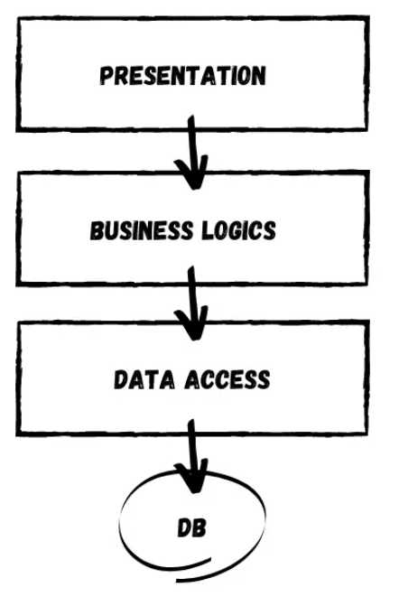
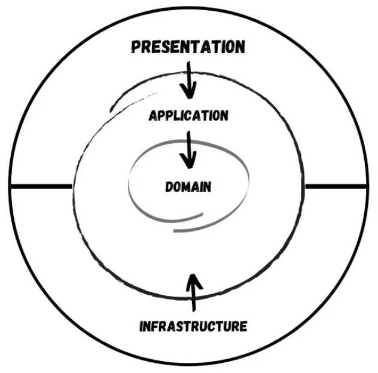

# Clean(Onion) Architecture


### Overview of the N-Layer Architecture
* Data Access(Database) is the Core of the Entire Application 
* The most popular Architecture 



```
[Presentation] ==> [Business Logic] ==> [Data Access]

** '==>': Project Dependency

- Presentation - Interact access point (WebApi, MVC, Webforms ...)
- Business Logic - 🤟Logic of Business requirements
- Data Access - Database access point


Disadvantages of N-Layer Architecture
- Project Dependency
- Highly decoupled structure
- Lower scalable/Flexibility applications
```


# Clean(Onion) Architecture

#### >> Core Layer(Domain and Application Layer) 
Domain(Entity) is the Core of the Entire Application 

Core Layers(Domain and Application Layer) is at the center

```
🙋💥
Domain Layer - (Solution-wise) Enterprise logic and entities
Application Layer - (Application-specific) Interfaces and types

Difference
- Domain Layer: Common types across the entire enterprise and sharable with other solutions
- Application Layer: Application-specific types and interfaces(DIP, Higher scalability)

The interfaces in the Application Layer will be implemented in the external layer(DIP, Higher scalability)
** DIP: Dependency Inversion Principle
```

#### >>  Presentation Layer
Projects that users can access (i.e. WebApi, Mvc Project, etc.)
```
For example,
- WebApi Project
- Mvc Project
- Webforms Project
- ,etc.
```
#### >>  Infrastructure Layer
Tricky a bit. Infrastructure can be anything.

```
For example,
- Entity Framework Core Layer for Accessing the DB
- Layer specifically made to generate JWT Tokens for Authentication
- Hangfire Layer
- ,etc.

```

## Implementing Onion Architecture in ASP.NET Core WebApi Project

```
<Features and Tech>
- Onion Architecture
- Entity Framework Core
- .NET Core 3.1 Library / .NET Standard 2.1 Library / ASP.NET Core 3.1 WebApi
- Swagger
- CQRS / Mediator Pattern using MediatR Library
- Wrapper Class for Responses
- CRUD Operations
- Inverted Dependencies
- API Versioning

```

### 1. Adding The Entities to the Domain Project
```
🙋💥
Domain Layer - (Solution-wise) Enterprise logic and entities

- models/entities
- Exception
- Validation rules
- Settings
- Common things throughout the solution.
```

```java
//Common/BaseEntity.cs in the Domain Project
public abstract class BaseEntity
{
    public int Id { get; set; }
}

//Entities/Product.cs in the Domain Project.
public class Product : BaseEntity
{
    public string Name { get; set; }
    public string Barcode { get; set; }
    public string Description { get; set; }
    public decimal Rate { get; set; }
}
```

### 2. Adding the Required Interfaces And Packages in the Application Layer
```
Application Layer - (Application-specific) Interfaces and types
- models/entities
- Exception
- Validation rules
- Settings
- Common things throughout the solution.
```
```
1. Add Reference to the Domain Project.
2. install the required packages via Console
    Install-Package MediatR.Extensions.Microsoft.DependencyInjection
    Install-Package Microsoft.EntityFrameworkCore
```

```

🙋<Key-point> 💥
We have an Entity named Product.
Now we need to establish this class as a Table using Entity Framework Core. 
So we need an ApplicationDBContext.
But💥 the catch is that we won’t create the actual concrete implementation of the ApplicationDbContext here in the Application Layer.
Rather, we will just add an IApplicatoinDbContext Interface so that the EF Logics does not belong to the Application Layer, but belong to the Persistence layer which is outside the core.

🙋 This is how you can invert the dependencies to build scalable applications.
[Example]
Now, the advantage is that tomorrow, you need a different implementation of the ApplicationDbContext,
you don’t need to touch the existing code base, but just add another Infrastructure layer for this purpose and implement the IApplicationDbContext. As simple as that.
```

```
3. Add an IApplicatoinDbContext
//namespace Application.Interfaces
public interface IApplicationDbContext
{
    DbSet<Product> Products { get; set; }
    Task<int> SaveChanges();
}
```
```
Let’s say you have around 100 interfaces and 100 implementations.
Do you add all these 100 lines of code to the Startup.cs to register them in the container? That would be insane from the maintainability point of view.

To keep things clean, what we can do is,
🙋‍♂️create a DependencyInjection static Class for every layer of the solution and only add the corresponding required services to the corresponding Class.
In this way, we are decentralizing the code lines and keeping our Startup class neat and tidy. 
```
```java
public static class DependencyInjection
{
    public static void AddApplication(this IServiceCollection services)
    {
        services.AddMediatR(Assembly.GetExecutingAssembly());
    }
}
//Here we just Added Mediator to the service collection and will implement the Mediator pattern later.
```

```
//And all you have to do in WebApi’s Startup class is just add one line.
//This essentially registers all the services associated with the Application Layer into the container.

services.AddApplication();

//and add dependency to the application layer
  <ItemGroup>
    <ProjectReference Include="..\Application\Application.csproj" />
  </ItemGroup>
```

### 3. Implementing MediatR for CRUD Operations
```
In the Application Layer, Create a New Folder called Features.
This will have all the logic related to each Feature / Entity.
Under this folder, add a new one and name it ProductFeatures. Then add a Commands and Queries folder to it.
```


#### CQRS (Command Query Responsibility Segregation)
```
Commands: Insert/Modify/Remove Operations on the system
Queries:  Fetch data from the database

🤷 What does CORS do for Clean Architecture?
Each query handler and command handler are responsible for only one operation and one responsibility.
-> 💥 No Dependecy(Clean Architecture's goal: Scalability/Flexibility/Low-coupled) 
```


#### Mediator (Command Query Responsibility Segregation)
```
MediatR nuget package is to communicate between objects and it helps in achieving the CQRS pattern and clean architecture by reducing dependency among objects.

🤷 What does MediatR do for Clean Architecture?

<Set up the MediatR usage case>
1. Dependency Setup
                                            Core
API(Presentation Layer) ==> [ Application Layer ==> Domain Layer ] 

2. Install the MediateR  in API(Presentation Layer)

3. Add the MediatR to our controller
   var clients = await _mediator.Send(new GetCustomersQuery());  
   In the API controller, the MediateR is responsible for sending the GetCustomersQuery 
   and this is how it interacts with the other objects.

In this current scenario( I said 'in this scenario of interaction b/w objects), 
💥 there is no dependency!!! 
   The API does not depend on the Application Layer.
   Instead, Api is to send the command and receive the command using Mediator.
   Loosely coupled

🤷 So again, What does MediatR do for Clean Architecture?
   MediatR nuget package helps in achieving the CQRS pattern and clean architecture.
   - MediatR in the controller of the API sends and receives commands to the Application Layer(Project) without a dependency.
```


### 4. Setting Up EF Core on the Persistence Project
Firstly, add a connection string to the appsettings.json found in the WebApi Project.
```
  "ConnectionStrings": {
    "DefaultConnection": "Server=(localdb)\\mssqllocaldb;Database=onionDb;Trusted_Connection=True;MultipleActiveResultSets=true"
  }
```
Let’s set up EFCore in the Persistence Layer and try to generate a database.
```
Install-Package Microsoft.EntityFrameworkCore
Install-Package Microsoft.EntityFrameworkCore.SqlServer
```
```
Do you remember we created an IApplicationDBContext Interface in the Application Layer? This is where we will be implementing it. 
Create a new folder named Context and add a new class ApplicationDbContext.
This class will implement IApplicationDBContext.
```
```
public class ApplicationDbContext : DbContext, IApplicationDbContext
{
    public ApplicationDbContext(DbContextOptions<ApplicationDbContext> options)
        : base(options)
    {
    }
    public DbSet<Product> Products { get; set; }
    public async Task<int> SaveChanges()
    {
        return await base.SaveChangesAsync();
    }
}
```

And in the Startup class/ ConfigureServices method of the WebApi Just Add the following line. You can now see the advantage of this kind of approach.
```
services.AddPersistence(Configuration);
```
### 5. Generate the Migrations and the Database

```
// in the WebApi Project.
Install-Package Microsoft.EntityFrameworkCore.Tools
Install-Package Microsoft.EntityFrameworkCore.Design

Now, open up the package manager console and select the Persistence project as the default project (as mentioned in the screenshot below.).
This is because the actual ApplicationDBContext is implemented in the Persistence layer, remember?
add-migration Initial
update-database
```

### 5. Adding API Versioning
add API Versioning to the WebAPI.
```
Install-Package Microsoft.AspNetCore.Mvc.Versioning
```

In the Startup/ConfigureServices of the API project, add these lines to register the Versioning.
```
#region API Versioning
// Add API Versioning to the Project
services.AddApiVersioning(config =>
{
    // Specify the default API Version as 1.0
    config.DefaultApiVersion = new ApiVersion(1, 0);
    // If the client hasn't specified the API version in the request, use the default API version number 
    config.AssumeDefaultVersionWhenUnspecified = true;
    // Advertise the API versions supported for the particular endpoint
    config.ReportApiVersions = true;
});
#endregion
```


### 5. Setting up the Controllers
```
This is the final step of setting up Onion Architecture In ASP.NET Core. We will have to wire up a controller to the Application Layer.

Create a Base Api Controller. This will be an Empty API Controller which will have API Versioning enabled in the Attribute and also a MediatR object. What is the aim of this Base Controller? It is just to reduce the lines of code. Say, we add a new controller. We will not have to re-define the API Versioning route or the Mediator object. But we will just add the BaseAPI Controller as the base class. Get it? I will show it in implementation.
```
```
Add a new Empty API Controller in the Controllers folder and name it BaseApiController.

using MediatR;
using Microsoft.AspNetCore.Http;
using Microsoft.AspNetCore.Mvc;
using Microsoft.Extensions.DependencyInjection;

namespace WebApi.Controllers
{
    [ApiController]
    [Route("api/v{version:apiVersion}/[controller]")]
    public abstract class BaseApiController : ControllerBase
    {
        private IMediator _mediator;
        protected IMediator Mediator => _mediator ??= HttpContext.RequestServices.GetService<IMediator>();
    }
}

```

```
You can see that we are adding the API Versioning data to the route attribute and also creating an IMediator object.

Next, let’s create our actual ENtity endpoint. Create a new folder inside the Controllers folder and name it ‘v1’. This means that this folder will contain all the Version 1 API Controllers. Read more about API Versioning to understand the need for this here.

Inside the v1 Folder, add a new empty API Controller named ProductController. Since this is a very basic controller that calls the mediator object, I will not go in deep. However, I have previously written a detailed article on CQRS implementation in ASP.NET Core 3.1 API. You could go through that article which covers the same scenario. Read it here.
```
```
[ApiVersion("1.0")]
public class ProductController : BaseApiController
{
    /// <summary>
    /// Creates a New Product.
    /// </summary>
    /// <param name="command"></param>
    /// <returns></returns>
    [HttpPost]
    public async Task<IActionResult> Create(CreateProductCommand command)
    {
        return Ok(await Mediator.Send(command));
    }
    /// <summary>
    /// Gets all Products.
    /// </summary>
    /// <returns></returns>
    [HttpGet]
    public async Task<IActionResult> GetAll()
    {
        return Ok(await Mediator.Send(new GetAllProductsQuery()));
    }
    /// <summary>
    /// Gets Product Entity by Id.
    /// </summary>
    /// <param name="id"></param>
    /// <returns></returns>
    [HttpGet("{id}")]
    public async Task<IActionResult> GetById(int id)
    {
        return Ok(await Mediator.Send(new GetProductByIdQuery { Id = id }));
    }
    /// <summary>
    /// Deletes Product Entity based on Id.
    /// </summary>
    /// <param name="id"></param>
    /// <returns></returns>
    [HttpDelete("{id}")]
    public async Task<IActionResult> Delete(int id)
    {
        return Ok(await Mediator.Send(new DeleteProductByIdCommand { Id = id }));
    }
    /// <summary>
    /// Updates the Product Entity based on Id.   
    /// </summary>
    /// <param name="id"></param>
    /// <param name="command"></param>
    /// <returns></returns>
    [HttpPut("[action]")]
    public async Task<IActionResult> Update(int id, UpdateProductCommand command)
    {
        if (id != command.Id)
        {
            return BadRequest();
        }
        return Ok(await Mediator.Send(command));
    }
}
```

That’s quite everything in this simple yet powerful implementation of Onion Architecture in ASP.NET Core. Build the application and let’s test it.
```
Since we are already talking about a form of Clean Architecture in ASP.NET Core Applications, it would help if you read about certain tips to write clean and scalable C# Code. This knowledge will drastically improve the way you start building applications in .NET – Read the article here (20 Tips to write Clean C# Code)

```

### 6. Testing

```
Run the application and open up Swagger. We will do a simple test to ensure that our solution works. I will just create a new product and make a request to query all the existing products as well.
```

### Advantages of Onion Architecture in ASP.NET Core
```
The advantages of this design are as follows.

Highly Testable – Since the Core has no dependencies on anything else, writing automated tests are flexible,

Database Independent – Since we have a clean separation of data access, it is quite easy to switch between different database providers.

Switchable UI Layer (Presentation) – Since we are keeping all the crucial logic away from the presentation layer, it is quite easy to switch to another tech – including Blazor.

Much Cleaner Codebase with well-structured Projects for better understanding with teams.
```

### Further Improvements

```
Authentication,
Exception Handling,
Mediator Pipeline Logging,
Error Logging,
Background Processing,
Response Wrappers

```
